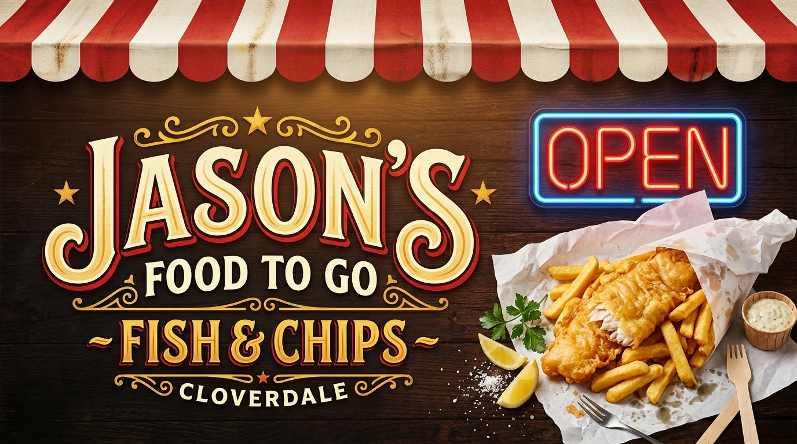
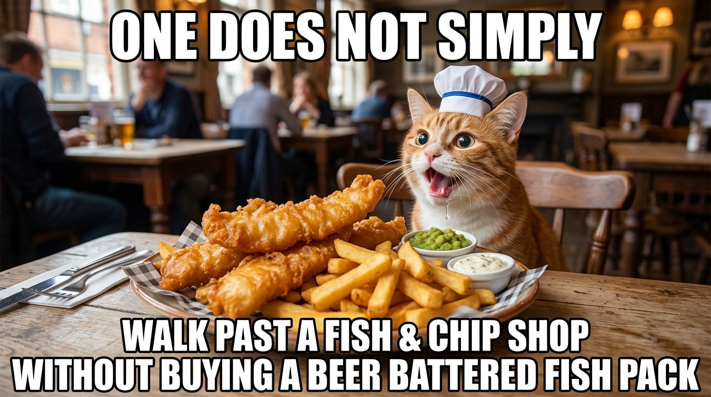
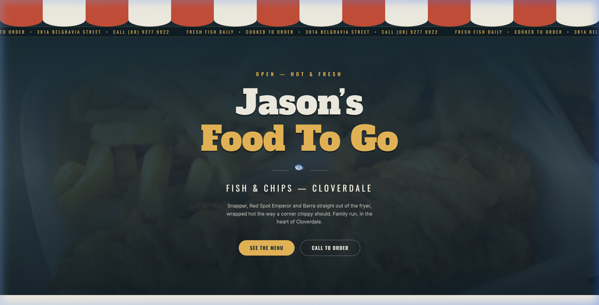
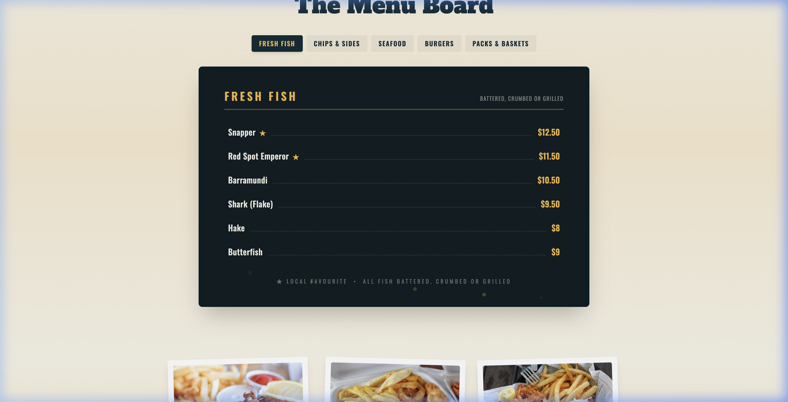
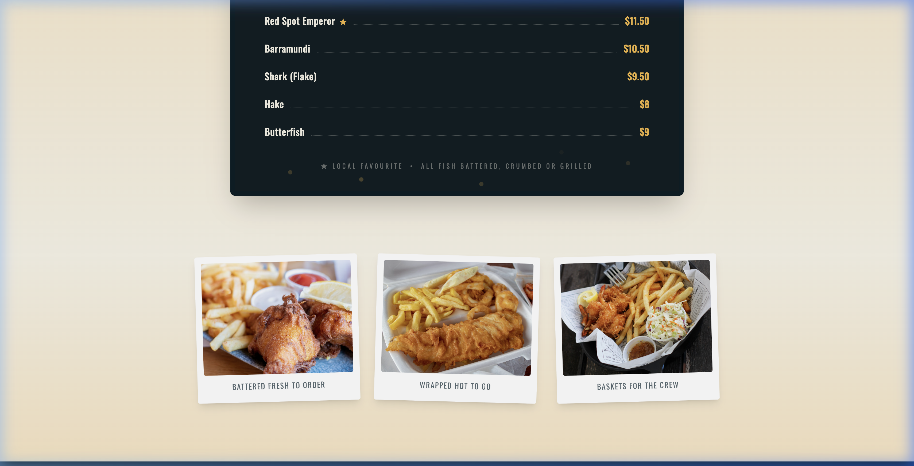
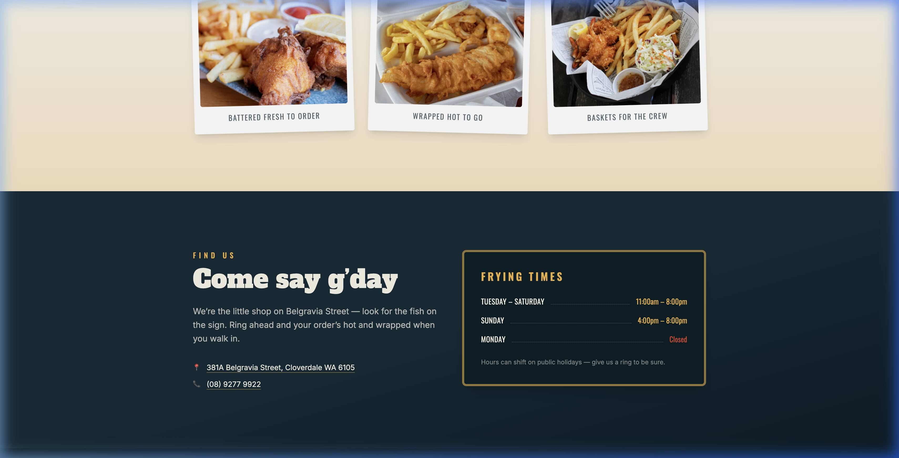
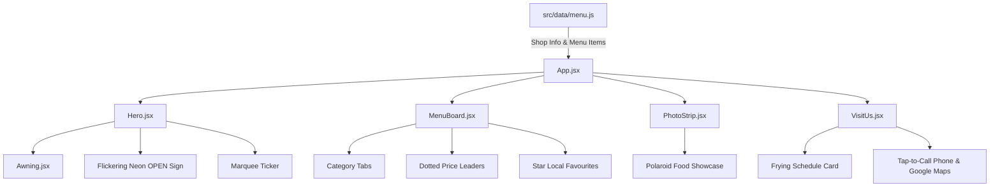

<div align="center">

  

  # 🐟 Jason's Food To Go — Fish & Chips

  **A nostalgia-infused, retro-styled single-page web app for Cloverdale's iconic family fish & chip shop.**

  [](https://react.dev/)
  [](https://vitejs.dev/)
  [](https://tailwindcss.com/)
  [](LICENSE)
  [](#-contributing)

  [Live Preview](#-live-demo--preview) • [Features](#-features) • [Quick Start](#-quick-start) • [Menu Customization](#-editing-the-menu-prices--shop-hours) • [Architecture](#-architecture--data-flow)

</div>

---

## 🍟 Fry-day Mood & Community Pride

<div align="center">
  
  <p><em>"There are two types of people: those who love hot chips with chicken salt, and those who haven't tried Jason's yet."</em> 🍟✨</p>
</div>

---

## 📖 Overview

**Jason's Food To Go** is a neighborhood fish and chip shop located at **381A Belgravia Street, Cloverdale WA 6105**.

This web application brings the authentic Australian takeaway shopfront experience online — featuring a striped scalloped awning, a flickering neon OPEN sign, a dynamic scrolling marquee ticker, an illuminated shop-window letterboard menu with local favorites, polaroid food photography, and live frying schedule updates.

---

## 📸 Live Demo & Preview

<div align="center">
  
</div>

---

## ✨ Features

| Feature | Description | Visual |
|---|---|---|
| 🏪 **Shopfront Branding** | Classic red & white striped scalloped SVG awning, slab-serif vintage signage, interactive flickering neon `OPEN` sign, and a continuous scrolling special ticker. |  |
| 📋 **Letterboard Menu** | Retro illuminated shop-window letterboard layout with interactive category tabs (*Fish*, *Chips & Sides*, *Packs*, *Drinks*), dotted price leaders, and star markers (★) for local favorites. |  |
| 📸 **Polaroid Photo Strip** | Authentic food showcase presented in angled Polaroid-style photo frames with subtle hover effects and tilt animations. |  |
| ⏱️ **Frying Times & Contact Card** | Real-time frying schedule, tap-to-call phone shortcut (`(08) 9277 4488`), street address with direct Google Maps navigation link. |  |
| ♿ **Accessibility & FX** | Full keyboard navigation support, skip links, smooth scroll-reveal animations, and automatic motion reduction respecting `prefers-reduced-motion`. | Dynamic steam & bubble animations |

---

## 🛠️ Tech Stack

- ⚛️ **[React 19](https://react.dev/)**: Modern component-driven UI with state hooks.
- ⚡ **[Vite 6](https://vitejs.dev/)**: Next-generation lightning-fast frontend build tooling.
- 🎨 **[Tailwind CSS v4](https://tailwindcss.com/)**: Utility-first CSS engine powering responsive styles, retro color palettes, and custom animations.
- 📍 **Google Maps Integration**: Direct navigation to 381A Belgravia St, Cloverdale WA.

---

## 🚀 Quick Start

### Prerequisites

- **Node.js** (v18.0.0 or higher recommended)
- **npm** (v9.0.0 or higher)

### Installation & Local Setup

1. **Clone the Repository**
   ```bash
   git clone https://github.com/thedalycreative/jasons-fish-and-chips.git
   cd jasons-fish-and-chips
   ```

2. **Install Dependencies**
   ```bash
   npm install
   ```

3. **Launch Dev Server**
   ```bash
   npm run dev
   ```
   Open `http://localhost:5173` in your browser to view the application live!

4. **Production Build**
   ```bash
   npm run build
   npm run preview
   ```

---

## ⚙️ Editing the Menu, Prices & Shop Hours

Everything a shop owner needs to configure lives in **one central data file**:

📄 [`src/data/menu.js`](file:///Users/thetimdaly/Desktop/VS%20Code/fish-and-chips-shop-cloverdale/src/data/menu.js)

```javascript
export const shop = {
  name: "Jason's Food To Go",
  address: "381A Belgravia Street, Cloverdale WA 6105",
  phone: "(08) 9277 4488",
  mapsUrl: "https://maps.google.com/?q=381A+Belgravia+Street+Cloverdale+WA+6105",
  hours: [
    { days: "Mon – Thu", time: "4:30 PM – 8:00 PM" },
    { days: "Fri – Sat", time: "4:30 PM – 8:30 PM" },
    { days: "Sunday", time: "Closed" },
  ]
};

export const menu = [
  {
    category: "Fish",
    items: [
      { name: "Snapper (Battered / Grilled)", price: "$12.50", star: true },
      { name: "Beer Battered Hake", price: "$10.00", star: false },
    ]
  },
  // ... add or modify categories & items easily!
];
```

> 💡 **Tip:** Set `star: true` on any menu item to highlight it as a **Local Favourite ★** on the illuminated letterboard menu!

---

## 📂 Project Directory Structure

```
fish-and-chips-shop-cloverdale/
├── docs/
│   └── images/               # Screenshots, banner visuals & demo webp
├── src/
│   ├── assets/               # High-res takeaway & seafood photos
│   ├── components/
│   │   ├── Awning.jsx        # Red & white striped scalloped SVG awning
│   │   ├── Hero.jsx          # Shop banner, flickering neon OPEN & marquee ticker
│   │   ├── MenuBoard.jsx     # Illuminated window letterboard with category tabs
│   │   ├── PhotoStrip.jsx   # Polaroid food photo gallery
│   │   ├── Reveal.jsx        # Scroll-reveal animation wrapper
│   │   └── VisitUs.jsx       # Address, telephone contact & frying times card
│   ├── data/
│   │   └── menu.js           # Editable shop details, hours & menu items
│   ├── App.jsx               # Main application view & structure
│   ├── index.css             # Tailwind v4 directives, custom retro fonts & FX
│   └── main.jsx              # React DOM render entrypoint
├── index.html                # HTML entrypoint & meta tags
├── package.json              # Dependencies & npm scripts
└── vite.config.js            # Vite configuration
```

---

## 📐 Architecture & Data Flow



---

## 🤝 Contributing

Contributions, issues, and feature requests are welcome!  
Feel free to check out open issues or submit pull requests.

1. Fork the Project
2. Create your Feature Branch (`git checkout -b feature/AmazingFeature`)
3. Commit your Changes (`git commit -m 'Add some AmazingFeature'`)
4. Push to the Branch (`git push origin feature/AmazingFeature`)
5. Open a Pull Request

---

## 📄 License & Credits

Distributed under the **MIT License**.

- **Food Photography**: Sourced from [Unsplash](https://unsplash.com) (free community license).
- **Design Inspiration**: Classic Perth neighborhood fish & chip shops & takeaway culture.

<div align="center">
  <br />
  <p>Made with ❤️ for Cloverdale & Fish & Chip lovers everywhere 🐟🍟</p>
</div>

